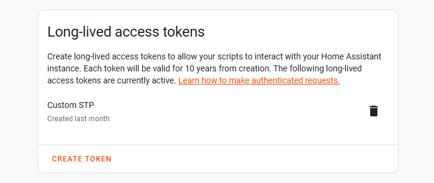

# Hướng dẫn triển khai Speech-to-Phrase Tiếng Việt cho Home Assistant


## Thiết lập Môi trường Phát triển

Yêu cầu **Python 3.10+**, **Git** và **Docker**.

### 1. Clone Source Code

```bash
git clone https://github.com/OHF-Voice/speech-to-phrase
cd speech-to-phrase
```

### 2. Tạo Môi trường ảo

```bash
# Windows
python -m venv .venv
.venv\Scripts\activate

# Linux/macOS
python3 -m venv .venv
source .venv/bin/activate

pip install --upgrade pip
pip install -r requirements.txt
```
---

## Tích hợp Mô hình & Dữ liệu

### 3. Tích hợp Mô hình Tiếng Việt (Model Integration)
Để thêm một mô hình mới (ví dụ `chunkformer` hoặc `phowhisper`), cần chỉnh sửa 2 file chính:

**B1. Khai báo mô hình trong `speech_to_phrase/models.py`:**

```python
# Thêm vào dictionary MODELS
Language.VIETNAMESE.value: Model(
    id="chunkformer-rnnt-large-vie",
    type=ModelType.CHUNKFORMER,  # Loại mô hình
    language="vi_VN", # Ngôn ngữ
    description="ChunkFormer Vietnamese Model",
    url="https://huggingface.co/khanhld/chunkformer-rnnt-large-vie",
    casing=WordCasing.LOWER,
)
```

**B2. Cấu hình luồng xử lý trong `speech_to_phrase/transcribe.py`:**

```python
# Thêm nhánh if cho mô hình mới
if model.type == ModelType.CHUNKFORMER:
    from .transcribe_chunkformer import transcribe_chunkformer
    return await transcribe_chunkformer(model, settings, audio_stream)
```

**B3. Tạo file logic nhận dạng `speech_to_phrase/transcribe_{model_type}.py`:**

File này chứa logic tải mô hình và thực hiện nhận dạng (STT). Hàm xử lý chính cần tuân thủ signature sau:

```python
async def transcribe_your_model(
    model: Model, 
    settings: Settings, 
    audio_stream: AsyncIterable[bytes]
) -> str:
    """
    Args:
        model: Đối tượng Model chứa metadata (id, url, casing...).
        settings: Cấu hình hệ thống (đường dẫn lưu model, v.v.).
        audio_stream: Stream dữ liệu âm thanh thô (16kHz, 16-bit mono PCM).
    
    Returns:
        Văn bản đã nhận dạng được (đã qua chuẩn hóa/casing).
    """
    # 1. Tải mô hình/resource từ settings.model_data_dir(model.id)
    # 2. Thu thập bytes từ audio_stream
    # 3. Chuyển đổi và nhận dạng
    return "văn bản kết quả"
```

### 4. Chuẩn bị Dữ liệu Test (`synthetic_vn`)
Tạo thư mục chứa dữ liệu âm thanh mẫu để kiểm thử.

```bash
mkdir -p tests/wav/vi/synthetic_vn
```

Đưa các file `.wav` vào. Định dạng file bắt buộc:
*   **Tên file:** Nội dung văn bản (transcript) mong đợi. Ví dụ: `bat_den_phong_khach.wav`.
*   **Định dạng âm thanh:** 16kHz, 16-bit, Mono.

---

## Kiểm thử Logic (Semantic Testing)

### 5. Chạy Test So khớp (Intent Matching Test)
Thay vì chỉ so sánh văn bản thuần túy (dễ sai do từ đồng nghĩa), ta sử dụng quy trình kiểm thử thông minh:
1.  **Speech-to-Text:** Chuyển audio thành text (VD: "mở đèn").
2.  **Intent Recognition:** Chuyển text thành Intent.
3.  **So sánh:** Nếu Intent của text nhận được khớp với Intent của tên file $\rightarrow$ **PASS**.

Lệnh chạy test:
```bash
# Chạy test cho ngôn ngữ tiếng Việt (vi)
pytest tests/test_transcribe.py --language=vi
```

**Kết quả mong đợi:**
```text
tests/test_transcribe.py::test_transcribe_bat_den_phong_khach PASSED
tests/test_transcribe.py::test_transcribe_mo_dieu_hoa PASSED
```


## Đóng gói Add-on (Docker)

### 6. Tạo Dockerfile
File `Dockerfile` định nghĩa môi trường chạy của Add-on. Sử dụng multi-stage build để tối ưu kích thước image.

```dockerfile
# Stage 1: Build dependencies
FROM python:3.12-slim as builder

# Install build dependencies
RUN apt-get update && apt-get install -y --no-install-recommends \
    build-essential \
    git \
    && rm -rf /var/lib/apt/lists/*

WORKDIR /app

# Copy project files
COPY pyproject.toml setup.cfg ./
COPY speech_to_phrase/ ./speech_to_phrase/

# Install CPU-only PyTorch first (tiết kiệm dung lượng)
RUN pip install --no-cache-dir --upgrade pip && \
    pip install --no-cache-dir torch torchvision torchaudio --index-url https://download.pytorch.org/whl/cpu

# Install the package
RUN pip install --no-cache-dir -e .

# Install chunkformer for Vietnamese model
RUN pip install --no-cache-dir chunkformer

# Install home-assistant-intents
RUN pip install --no-cache-dir home-assistant-intents==2025.6.23

# Copy your custom intents file (override the default)
COPY custom_intents/data/vi.json /usr/local/lib/python3.12/site-packages/home_assistant_intents/data/vi.json

# Stage 2: Runtime
FROM python:3.12-slim

# Only install runtime system dependencies
RUN apt-get update && apt-get install -y --no-install-recommends \
    sox \
    && rm -rf /var/lib/apt/lists/* \
    && apt-get clean

WORKDIR /app

# Copy installed Python packages from builder
COPY --from=builder /usr/local/lib/python3.12/site-packages /usr/local/lib/python3.12/site-packages
COPY --from=builder /usr/local/bin /usr/local/bin

# Copy application code
COPY --from=builder /app /app

# Copy run script and use it as entrypoint
COPY rootfs/run.sh /run.sh
RUN chmod +x /run.sh

CMD ["/run.sh"]
```

**Giải thích:**
*   **Multi-stage build:** Stage 1 cài đặt dependencies và build, Stage 2 chỉ copy những gì cần thiết để chạy (giảm kích thước image).
*   **CPU-only PyTorch:** Sử dụng PyTorch CPU-only thay vì GPU version để giảm kích thước từ ~4.5GB xuống ~500MB.
*   **Custom intents:** Copy file `vi.json` tùy chỉnh để override intents mặc định của Home Assistant.

### 6.1. Tạo file entrypoint `rootfs/run.sh`
File `rootfs/run.sh` là script khởi chạy của container, đóng vai trò là entrypoint khi Docker container được start. Script này có nhiệm vụ:

1. **Kiểm tra và đọc token xác thực:** Đọc biến môi trường `HASS_TOKEN` (được truyền từ `config.yaml` qua `environment`).
2. **Thiết lập WebSocket URI:** Cho phép override URI kết nối Home Assistant (mặc định: `ws://homeassistant:8123/api/websocket`).
3. **Khởi chạy ứng dụng:** Gọi `python -m speech_to_phrase` với các tham số cấu hình.

**Nội dung file `rootfs/run.sh`:**

```bash
#!/bin/sh
set -e

# Expect a long-lived Home Assistant token in HASS_TOKEN
if [ -z "$HASS_TOKEN" ]; then
  echo "HASS_TOKEN is empty. Provide a long-lived HA token via env." >&2
  exit 1
fi

# Allow overriding the HA websocket URI via HASS_WS_URI
: "${HASS_WS_URI:=ws://homeassistant:8123/api/websocket}"

exec python -m speech_to_phrase \
  --uri tcp://0.0.0.0:10300 \
  --train-dir /data/train \
  --tools-dir /data/tools \
  --models-dir /data/models \
  --hass-websocket-uri "$HASS_WS_URI" \
  --hass-token "$HASS_TOKEN"
```

**Giải thích các tham số:**

*   `--uri tcp://0.0.0.0:10300`: Địa chỉ và port cho Wyoming protocol server (lắng nghe trên tất cả interfaces).
*   `--train-dir /data/train`: Thư mục lưu dữ liệu training (được mount từ `share` volume).
*   `--tools-dir /data/tools`: Thư mục lưu các công cụ hỗ trợ.
*   `--models-dir /data/models`: Thư mục chứa các mô hình STT (được mount từ host hoặc volume).
*   `--hass-websocket-uri`: URI WebSocket của Home Assistant để giao tiếp với API.
*   `--hass-token`: Long-lived access token để xác thực với Home Assistant API.

**Lưu ý quan trọng:**

*   File phải nằm trong thư mục `rootfs/` của repository (để Dockerfile có thể copy vào image).
*   Phải có quyền thực thi (`chmod +x rootfs/run.sh`).
*   Script sử dụng `#!/bin/sh` (POSIX shell) để tương thích với base image `python:3.12-slim`.
*   `set -e` đảm bảo script dừng ngay khi có lỗi.
*   `exec` thay thế shell process bằng Python process (giúp nhận tín hiệu SIGTERM đúng cách).

### 6.2. Tùy chỉnh Intents Tiếng Việt (Custom Intents)
Nếu muốn thêm hoặc sửa đổi các intents tiếng Việt, tạo file `custom_intents/data/vi.json`:

```bash
mkdir -p custom_intents/data
# Copy file vi.json vào đây hoặc chỉnh sửa từ file mặc định
```

File này sẽ override file mặc định trong package `home-assistant-intents`. Cấu trúc file tuân theo format của Home Assistant intents:

```json
{
  "language": "vi",
  "intents": {
    "HassTurnOn": {
      "data": [
        {
          "sentences": ["bật {name}", "mở {name}", "bật {name} lên"],
          "slots": {
            "name": {
              "type": "area|device|entity"
            }
          }
        }
      ]
    }
  }
}
```

Sau khi tạo file, Dockerfile sẽ tự động copy vào image khi build.

### 7. Thiết lập GitHub Actions (CI/CD)
Để tự động build và push Docker image lên Docker Hub mỗi khi push code, tạo file `.github/workflows/build-docker.yml`:

```yaml
name: Build and Push Docker Image

on:
  push:
    branches: [ main, master ]
  workflow_dispatch:

jobs:
  build:
    runs-on: ubuntu-latest
    steps:
      - uses: actions/checkout@v3
      
      - name: Set up Docker Buildx
        uses: docker/setup-buildx-action@v2
      
      - name: Login to Docker Hub
        uses: docker/login-action@v2
        with:
          username: ${{ secrets.DOCKERHUB_USERNAME }}
          password: ${{ secrets.DOCKERHUB_TOKEN }}
      
      - name: Build and push
        uses: docker/build-push-action@v4
        with:
          context: .
          platforms: linux/amd64,linux/aarch64
          push: true
          tags: |
            your-username/speech_to_phrase_custom:latest
            your-username/speech_to_phrase_custom:1.0.0
            your-username/speech_to_phrase_custom:${{ github.sha }}
```

**Thiết lập GitHub Secrets:**

1. Vào repository trên GitHub → **Settings** → **Secrets and variables** → **Actions**.
2. Thêm 2 secrets:
   *   `DOCKERHUB_USERNAME`: Tên đăng nhập Docker Hub của bạn.
   *   `DOCKERHUB_TOKEN`: Access token từ Docker Hub (tạo tại Account Settings → Security → New Access Token).

**Lưu ý:**
*   Workflow sẽ build cho cả `amd64` và `aarch64` (Raspberry Pi).
*   Image được tag với `latest`, version number, và commit SHA.
*   Có thể trigger thủ công qua tab **Actions** → **Build and Push Docker Image** → **Run workflow**.

### 8. Tạo file cấu hình `config.yaml`
File này giúp Home Assistant hiểu về Add-on. Tạo file tại `/data/addons/local/speech_to_phrase_custom/config.yaml` trên thiết bị Home Assistant.

```yaml
---
version: 1.0.0
slug: speech_to_phrase_custom
name: Speech-to-Phrase (Custom)
description: Custom build of Speech-to-Phrase with Vietnamese ChunkFormer support
arch:
  - amd64
  - aarch64
init: false
discovery:
  - wyoming
map:
  - share:rw
  - /root/TrungVD/model:/data/models:rw
backup_exclude:
  - "*/models/*"
homeassistant_api: true
options:
  hass_token: ""
schema:
  hass_token: str
ports:
  "10300/tcp": null
homeassistant: 2023.11.0
image: your-username/speech_to_phrase_custom
environment:
  HASS_TOKEN: "{{ hass_token }}"
```

**Giải thích các trường:**

*   `version`: Phiên bản add-on (phải khớp với Docker image tag).
*   `slug`: Tên duy nhất, chỉ dùng chữ thường, số, gạch dưới (không dùng gạch ngang).
*   `discovery: [wyoming]`: Tự động phát hiện add-on qua Wyoming protocol.
*   `map`: Volume mounts
    *   `share:rw`: Mount thư mục `/share` của HA (lưu train data, tools).
    *   `/root/TrungVD/model:/data/models:rw`: Mount thư mục models từ host (pre-downloaded models).
*   `homeassistant_api: true`: Cho phép add-on truy cập Home Assistant API.
*   `options` và `schema`: Định nghĩa cấu hình người dùng (hass_token).
*   `environment`: Truyền biến môi trường vào container (`{{ hass_token }}` là template variable).
*   `image`: Tên Docker image (không được có tag `:latest` trong config.yaml, Supervisor tự thêm version tag).

**Lưu ý về image name:**
*   Supervisor có regex validation nghiêm ngặt cho image name.
*   Không được có tag `:latest` trong `config.yaml`.
*   Supervisor tự động thêm tag `:<version>` khi pull image.
*   Ví dụ: `image: username/repo` → pull `username/repo:1.0.0`.

---

## Cài đặt & Cấu hình trên Home Assistant

### 9. Tải Model trước (Pre-download Models)
Để tránh tải model mỗi lần chạy, có thể tải model trước và mount vào container.

**Cách 1: Tải trên thiết bị Home Assistant (qua SSH)**

```bash
# SSH vào thiết bị HA
ssh root@your-ha-device

# Tạo thư mục lưu model
mkdir -p /root/TrungVD/model

# Tải model ChunkFormer (ví dụ)
cd /root/TrungVD/model
# Sử dụng huggingface-cli hoặc git lfs để tải
huggingface-cli download khanhld/chunkformer-rnnt-large-vie --local-dir chunkformer-rnnt-large-vie
```

**Cách 2: Tải trên máy local và copy qua**

```bash
# Trên máy local
huggingface-cli download khanhld/chunkformer-rnnt-large-vie --local-dir ./models/chunkformer-rnnt-large-vie

# Copy qua SSH
scp -r ./models/chunkformer-rnnt-large-vie root@your-ha-device:/root/TrungVD/model/
```

**Lưu ý:** Đảm bảo đường dẫn trong `config.yaml` (`/root/TrungVD/model`) khớp với vị trí lưu model.

### 10. Chuẩn bị Token & URI
Để Add-on giao tiếp được với Home Assistant (để bật/tắt thiết bị), cần có thông tin xác thực.

1.  **URI:** Thông thường là `ws://homeassistant:8123/api/websocket` (trong container) hoặc `ws://homeassistant.local:8123/api/websocket` (từ bên ngoài).
2.  **Token:**
    *   Truy cập Profile (Avatar ở góc dưới bên trái) $\rightarrow$ **Security**.
    *   Kéo xuống phần **Long-Lived Access Tokens**.
    *   Tạo Token mới và **copy ngay** chuỗi ký tự dài đó (không xem lại được sau khi đóng).
    *   Token có dạng: `eyJ0eXAiOiJKV1QiLCJhbGc...` (rất dài, ~200+ ký tự).

>  *Hình ảnh giao diện Home Assistant phần tạo Long-Lived Access Token.*

### 11. Cài đặt Add-on (Local)
1.  **Tạo thư mục add-on trên HA device:**
    ```bash
    ssh root@your-ha-device
    mkdir -p /data/addons/local/speech_to_phrase_custom
    cd /data/addons/local/speech_to_phrase_custom
    ```

2.  **Tạo file `config.yaml`:**
    *   Dùng File Editor add-on trong HA, hoặc
    *   SSH và dùng `nano` / `vi`:
    ```bash
    nano /data/addons/local/speech_to_phrase_custom/config.yaml
    # Paste nội dung từ phần 8
    ```

3.  **Reload add-ons:**
    *   Vào **Settings** $\rightarrow$ **Add-ons** $\rightarrow$ **Add-on Store**.
    *   Nhấn nút **3 chấm** góc trên bên phải $\rightarrow$ **Check for updates**.
    *   Add-on "Speech-to-Phrase (Custom)" sẽ xuất hiện ở phần **Local add-ons**.

4.  **Cài đặt và cấu hình:**
    *   Click **Install** để pull Docker image.
    *   Sau khi install xong, vào tab **Configuration**.
    *   Paste Long-Lived Access Token vào ô `hass_token`.
    *   Click **Save**.
    *   Bật **Start on boot** nếu muốn tự động khởi động.
    *   Click **Start** để chạy add-on.

---

## Kiểm thử Tích hợp (E2E)

### 12. Kiểm tra Logs và Trạng thái Add-on
Sau khi start add-on, kiểm tra logs để đảm bảo không có lỗi:

1.  Vào **Settings** $\rightarrow$ **Add-ons** $\rightarrow$ **Speech-to-Phrase (Custom)**.
2.  Click tab **Log** để xem logs.
3.  **Logs bình thường sẽ có:**
    ```
    [INFO] Starting Wyoming server on tcp://0.0.0.0:10300
    [INFO] Connected to Home Assistant WebSocket
    [INFO] Model loaded: chunkformer-rnnt-large-vie
    ```

4.  **Kiểm tra trạng thái:**
    *   Tab **Info**: Status phải là **Running**.
    *   Tab **Log**: Không có lỗi `auth_invalid` hoặc `exec /run.sh: no such file or directory`.

### 13. Thêm thiết bị ảo để Test
Để test mà không cần phần cứng thật, ta tạo một cái đèn ảo qua MQTT hoặc Helper.

**Cách 1: Tạo Helper trong HA UI**
1.  Vào **Settings** $\rightarrow$ **Devices & Services** $\rightarrow$ **Helpers**.
2.  Click **Create Helper** → Chọn **Toggle**.
3.  Đặt tên: "Đèn Phòng Ngủ", ID: `light_den_phong_ngu`.
4.  Click **Create**.

**Cách 2: Tạo qua MQTT (nếu có MQTT broker)**
Gửi payload sau vào topic `homeassistant/light/virtual_test/config`:

```json
{
  "name": "Đèn Phòng Ngủ",
  "unique_id": "virtual_light_test",
  "command_topic": "home/test/light/set",
  "state_topic": "home/test/light/state",
  "payload_on": "ON",
  "payload_off": "OFF"
}
```

*Sau bước này, một entity `light.den_phong_ngu` sẽ xuất hiện trong HA.*

### 14. Kiểm thử Thực tế với Assist
1.  **Cấu hình Assist:**
    *   Vào **Settings** $\rightarrow$ **Voice assistants**.
    *   Tạo hoặc chỉnh sửa Assist.
    *   Chọn **Wyoming** làm STT provider.
    *   Chọn add-on "Speech-to-Phrase (Custom)" từ danh sách.

2.  **Test bằng giọng nói:**
    *   Mở Assist trong HA (icon microphone hoặc qua voice command).
    *   Nói: "bật đèn phòng ngủ" hoặc "mở đèn phòng ngủ".
    *   Quan sát Log của add-on:
        ```
        [INFO] Transcript: "bật đèn phòng ngủ"
        [INFO] Intent: HassTurnOn (name="Đèn Phòng Ngủ")
        [INFO] Executing: light.den_phong_ngu.turn_on()
        ```

3.  **Kiểm tra kết quả:**
    *   Vào Dashboard → Entity `light.den_phong_ngu` đã chuyển sang **ON**.
    *   Hoặc kiểm tra trong **Developer Tools** → **States**.

### 15. Troubleshooting (Xử lý lỗi)

**Lỗi: `Can't read /data/addons/local/.../config.yaml: does not match regular expression`**
*   **Nguyên nhân:** Image name trong `config.yaml` không đúng format (có tag `:latest` hoặc ký tự không hợp lệ).
*   **Giải pháp:**
    1.  Xóa tag `:latest` khỏi `image:` field.
    2.  Đảm bảo chỉ dùng chữ thường, số, gạch dưới (không dùng gạch ngang trong một số vị trí).
    3.  Format đúng: `image: username/repo_name` (không có tag).

**Add-on không xuất hiện trong Local add-ons**
*   **Nguyên nhân:** File `config.yaml` không đúng vị trí hoặc format sai.
*   **Giải pháp:**
    1.  Kiểm tra đường dẫn: `/data/addons/local/speech_to_phrase_custom/config.yaml`.
    2.  Kiểm tra format YAML (indentation, không dùng tab).
    3.  Click "Check for updates" trong Add-on Store.
    4.  Xem logs của Supervisor: `docker logs addon_core_configurator` hoặc qua SSH.

**Model không tải được**
*   **Nguyên nhân:** Đường dẫn model không đúng hoặc model chưa được tải.
*   **Giải pháp:**
    1.  Kiểm tra mount point trong `config.yaml`: `/root/TrungVD/model:/data/models:rw`.
    2.  Kiểm tra model có tồn tại: `ls -la /root/TrungVD/model/chunkformer-rnnt-large-vie`.
    3.  Kiểm tra quyền truy cập: `chmod -R 755 /root/TrungVD/model`.
    4.  Xem logs để biết model đang tải từ đâu.

---

## Tóm tắt Quy trình Triển khai

### Checklist Triển khai

1.  **Phát triển:**
    *   [ ] Clone repository và setup môi trường
    *   [ ] Tích hợp mô hình tiếng Việt (ChunkFormer, PhoWhisper, VietASR)
    *   [ ] Tùy chỉnh intents (`custom_intents/data/vi.json`)
    *   [ ] Chạy tests (`pytest tests/test_transcribe.py --language=vi`)

2.  **Đóng gói:**
    *   [ ] Tạo `Dockerfile` (multi-stage build, CPU-only PyTorch)
    *   [ ] Tạo `rootfs/run.sh` (entrypoint script)
    *   [ ] Thiết lập GitHub Actions workflow
    *   [ ] Push code và trigger build
    *   [ ] Kiểm tra image trên Docker Hub

3.  **Triển khai:**
    *   [ ] Tải model trước (pre-download) trên HA device
    *   [ ] Tạo `config.yaml` tại `/data/addons/local/speech_to_phrase_custom/`
    *   [ ] Tạo Long-Lived Access Token
    *   [ ] Reload add-ons và install
    *   [ ] Cấu hình token trong add-on
    *   [ ] Start add-on và kiểm tra logs

4.  **Kiểm thử:**
    *   [ ] Tạo thiết bị ảo (Helper hoặc MQTT)
    *   [ ] Cấu hình Assist với Wyoming provider
    *   [ ] Test bằng giọng nói
    *   [ ] Kiểm tra intent matching và device control

---

## Link Tham khảo

### Tài liệu Chính thức
*   [Home Assistant Add-on Development](https://developers.home-assistant.io/docs/add-ons/)
*   [Add-on Configuration Reference](https://developers.home-assistant.io/docs/add-ons/configuration)
*   [Add-on Tutorial](https://developers.home-assistant.io/docs/add-ons/tutorial)
*   [Wyoming Protocol Documentation](https://github.com/rhasspy/wyoming)

### Dự án Liên quan
*   [ChunkFormer Model](https://huggingface.co/khanhld/chunkformer-rnnt-large-vie)
*   [Home Assistant Intents](https://github.com/home-assistant/intents)
